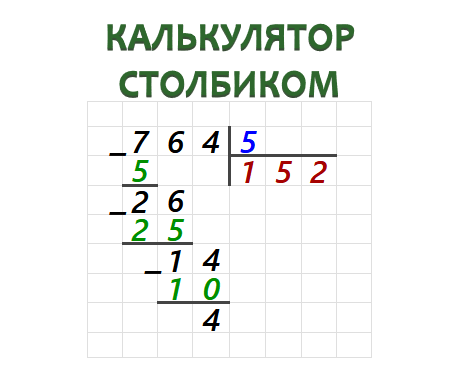

## Вычисление (англ. calculation или computation: в чем разница?)

Calculation - это теоретическое математически-логическое вычисление.

Например выражение `10 / 5` легко выполнить в уме, зная правила деления. Это `calculation`. `Calcuation` - это математическо-логические правила.

Если надо разделить `12345 / 17`, то немногие смогут сделать это в уме, то есть calculate, хотя правила известны.

Для более сложных делений существуют разные методы, процессы, например "деление столбиком". Для этого надо как минимум лист бумаги и карандаш, или песок и веточку, на чем "писать". В общем смысле нужны дополнительные ресурсы. И (зачастую итартивный) техпроцесс. Это `computation`.

Помните, да?

То есть, можно сказать `calculation` отвечает на вопрос `ЧТО?`, что должно получиться от деления `12345 / 17` согласно правилам.

А `computation` отвечает на вопрос `КАК?`, как это сделать, чтобы получить ответ. И для `computation` нужны ресурсы: процессор, память, время.
