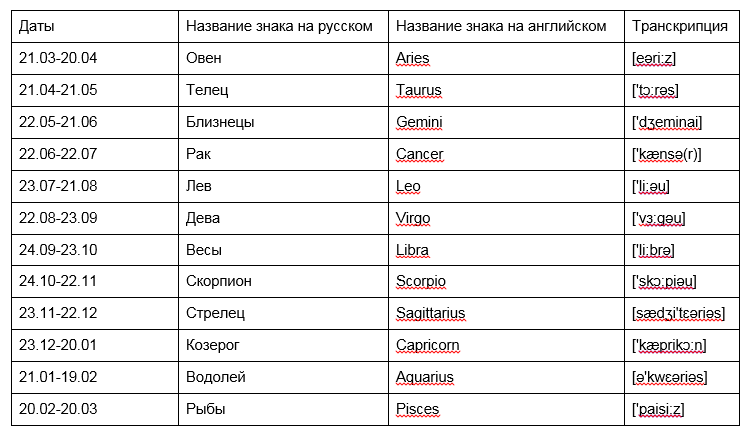

## Продолжаем с зодиаком

```ts
// zodiak.ts
type _Date = string;
type Zodiak = 'Aries' | "blah blah blah";

function foo(date : _Date) : Zodiak {
    return 'Aries';
}
console.log(
    foo('asdfas')
);
```

Что мы знаем о зодиаке?



То есть, если наша дата попадает между 21.03 и 20.04, то это Овен, а иначе, если наша дата попадает ...

Логика ясна!

```ts
// zodiak.ts
type _Date = string;
type Zodiak = 'Aries' | "blah blah blah";

function foo(date : _Date) : Zodiak {
    if (/* date между 21.03 и 20.04 */) {
        return 'Aries';
    } else if (/* date между 21.04 и 21.05 */) {
        return 'Taurus';
    } else {
        return ???;
    }   
}
console.log(
    foo('asdfas')
);
```

Все что нам известно написали на JavaScript, некоторые моменты оставили в псевдокоде или поставили ???

Начнем по порядку. Как на JavaScript узнать 21.03 < date < 20.04 ? При том, что `date : string`.

(Погуглили)[https://www.google.com/search?q=javascript+date+between&oq=javascript+date+between&aqs=chrome..69i57.11254j0j9&sourceid=chrome&ie=UTF-8] и поняли, что тема эта не простая! А может быть мы уже знаем как работать с датами. Не важно! Важно умение абстрагироваться. То есть представим, что функция, отвечающая ДА, когда заданная дата находится между двумя другими датами, и НЕТ, когда не находится между ними, уже существует, и называется `bar : Date -> Date -> Date -> boolean`

```ts
// zodiak.ts
type _Date = string;
type Zodiak = 'Aries' | "blah blah blah";

function bar(date : _Date, dateA : _Date, dateB : _Date) : boolean {
    // TODO: implement
    return true;
}

function foo(date : _Date) : Zodiak {
    if (bar(date, ?21.03, ?20.04)) {
        return 'Aries';
    } else if (bar(date, ?21.04, ?21.05)) {
        return 'Taurus';
    } else {
        return ???;
    }   
}
console.log(
    foo('asdfas')
);
```

Ну и тут как раз тот случай, когда тип функции + ее имя, лучше всего передают ее суть

```ts
// zodiak.ts
type _Date = string;
type Zodiak = 'Aries' | "blah blah blah";

function between(date : _Date, dateA : _Date, dateB : _Date) : boolean {
    // TODO: implement
    return true;
}

function foo(date : _Date) : Zodiak {
    if (between(date, ?21.03, ?20.04)) {
        return 'Aries';
    } else if (between(date, ?21.04, ?21.05)) {
        return 'Taurus';
    } else {
        return ???;
    }   
}
console.log(
    foo('asdfas')
);
```

Теперь новый вопрос: в каком виде представлять эти ?21.03, ?20.04, ?21.04, ?21.05 ? Тут прийдется читать том энциклопедии по JavaScript по работе с датами. Но мы уже знаем, что есть тип `Date`! И лучше все даты, представлять в виде значений этого типа. Помните? Тип определяет алгебру, то есть действия, которые можно совершать со значениями этого типа.

```ts
// zodiak.ts
type Zodiak = 'Aries' | "blah blah blah";

function between(date : Date, dateA : Date, dateB : Date) : boolean {
    // TODO: implement
    return true;
}

function foo(date : Date) : Zodiak {
    if (between(date, new Date(21.03), new Date(20.04))) {
        return 'Aries';
    } else if (between(date, new Date(21.04), new Date(21.05))) {
        return 'Taurus';
    } else {
        return ???;
    }
}
console.log(
    foo('asdfas')
);
```

Только вот, собирая дату в JS вот так `new Date(21.03)`, мы получаем что-то другое

```bash
$> node
Welcome to Node.js v14.19.3.
Type ".help" for more information.
> new Date(21.03)
1970-01-01T00:00:00.021Z
> 
```

А вот так уже лучше `new Date('2022-03-21')`.

```bash
> new Date('2022-03-21')
2022-03-21T00:00:00.000Z
> 
```

Только вот откуда год взять? Хотя стоп! Какая разница который год? Знаки зодиака от года не зависят, они каждый год одни и те же. То есть, для сравнения, нам годится, что `new Date('2022-03-21')`, что `new Date('2022-03-21')`, что `new Date('2035-03-21')`, что год начала отсчета компьютерного времени 1970: `new Date('1970-03-21')`

Заметьте, мы сконцентрированно работаем над решением одной мелкой проблемы: как собрать значение типа Date (A) => чтобы мочь сравнивать даты между собой (B) => чтобы мочь выносить решение находится ли наша заданная дата между двумя другими (C) => чтобы определить знак зодиака

```ts
// zodiak.ts
type Zodiak = 'Aries' | "blah blah blah";

function between(date : Date, dateA : Date, dateB : Date) : boolean {
    // TODO: implement
    return true;
}

function foo(date : Date) : Zodiak {
    if (between(date, >>>AAA>>>( ... )<<<AAA<<<, >>>AAA>>>( ... )<<<AAA<<<)) {
        return 'Aries';
    } else if (between(date, >>>AAA>>>( ... )<<<AAA<<<, >>>AAA>>>( ... )<<<AAA<<<)) {
        return 'Taurus';
    } else {
        return ???;
    }
}
console.log(
    foo('asdfas')
);
```

Мы, как хирурги, высокоточно работаем в локальной области: для решения проблемы (A) строго внутри области ограниченной `>>>AAA>>>( ... )<<<AAA<<<`. Мы не меняем "скелет" программы, одновременно с этим. Это рецепт для катастрофы и чрезвычайного разочарования (так знакомого любому студенту). Может случится и так, что наш "скелет" оказался неправильным, не самым удачным для задачи и требует изменений, но не следует вносить изменения сразу и в "скелет" и в "мышцы".

У нас пока нету подозрения, что скелет неудачный. Поэтому мы продолжаем работать локально с отдельными мелкими мышцами и органами.

```ts
// zodiak.ts
type Zodiak = 'Aries' | "blah blah blah";

function between(date : Date, dateA : Date, dateB : Date) : boolean {
    // TODO: implement
    return true;
}

function foo(date : Date) : Zodiak {
    if (between(date, new Date('1970-03-21'), new Date('1970-04-20')) {
        return 'Aries';
    } else if (between(date, new Date('1970-04-21'), new Date('1970-05-21'))) {
        return 'Taurus';
    } else {
        return ???;
    }
}
console.log(
    foo('asdfas')
);
```

Еще одно замечание: я не работаю над всеми ветками этого if, достаточно одной, двух. Чтобы "набить руку". И если подход окажется работающим, добавить остальные ветки под копирку - уже дело техники. Вы ведь не думаете, что Вы способны забыть про них потом, и поэтому лучше сделать их сейчас? Если думаете так, то представьте другую ситуацию. Вы сделали все 12 веток, остались довольны своей скурпулезностью, но через некоторые время обнаружили, что скелет этот (if этот в данном случае) вообще не годится. Какое же разочарование, что столько времени было потрачено зря.

Что-то мы давно не испытывали всплеска серотонина!

```bash
$> tsc zodiak.ts
zodiak.ts:10:67 - error TS1005: ')' expected.

10     if (bar(date, new Date('1970-03-21'), new Date('1970-04-20')) {
                                                                     ~

  zodiak.ts:10:8
    10     if (bar(date, new Date('1970-03-21'), new Date('1970-04-20')) {
              ~
    The parser expected to find a ')' to match the '(' token here.

zodiak.ts:15:16 - error TS1109: Expression expected.

15         return ???;
                  ~~

zodiak.ts:15:18 - error TS1109: Expression expected.

15         return ???;
                    ~

zodiak.ts:15:19 - error TS1109: Expression expected.

15         return ???;
                     ~


Found 4 errors in the same file, starting at: zodiak.ts:10
```

Проведите рефлексию здесь, интроспекцию: Вы уже не так сильно пугаетесь этим ошибкам, правда? По мере продвижения мелкими шагами растет уверенность! Я бы даже сказал есть пропорциональная зависимость между количеством тестировочных запусков программы и уровнем страха/удовлетворения. У обычного студента-программиста все наоборот: запуск один, в конце, через неделю работы, и уровень расстройства его психики равен кардиналити типа `string`. Вы еще помните что это такое? ;-) Почему? Потому что аксиома: первый запуск чего-либо априори провальный, первый блин - комом. Так почему бы этот блин не испечь в первые 10 мин работы над задачей?

Что там с ошибками? Скобку всего лишь забыли

```ts
// zodiak.ts
type Zodiak = 'Aries' | "blah blah blah";

function between(date : Date, dateA : Date, dateB : Date) : boolean {
    // TODO: implement
    return true;
}

function foo(date : Date) : Zodiak {
    if (between(date, new Date('1970-03-21'), new Date('1970-04-20'))) {
        return 'Aries';
    } else if (between(date, new Date('1970-04-21'), new Date('1970-05-21'))) {
        return 'Taurus';
    } else {
        return ???;
    }
}
console.log(
    foo('asdfas')
);
```

Тестируем!

```bash
$> tsc zodiak.ts                                                                                                                               12:43:33
zodiak.ts:15:16 - error TS1109: Expression expected.

15         return ???;
                  ~~

zodiak.ts:15:18 - error TS1109: Expression expected.

15         return ???;
                    ~

zodiak.ts:15:19 - error TS1109: Expression expected.

15         return ???;
                     ~


Found 3 errors in the same file, starting at: zodiak.ts:15
```

Так! Мы добрались до тех самых граблей, которые туда сами положили. Тот else там зачем? Затем, что теоретически может быть так, что дата не попала ни в один интервал! Вы спросите, как это так? Murphy говорит, что все может случиться - когда-нибудь обязательно случится! А мы подождем и подстрахуемся.

```ts
// zodiak.ts
type Zodiak = 'Aries' | "blah blah blah";

function between(date : Date, dateA : Date, dateB : Date) : boolean {
    // TODO: implement
    return true;
}

function foo(date : Date) : Zodiak {
    if (between(date, new Date('1970-03-21'), new Date('1970-04-20'))) {
        return 'Aries';
    } else if (between(date, new Date('1970-04-21'), new Date('1970-05-21'))) {
        return 'Taurus';
    } else {
        return '???';
    }
}
console.log(
    foo('asdfas')
);
```

Запускаем!

```bash
$> tsc zodiak.ts
zodiak.ts:13:9 - error TS2322: Type '"Taurus"' is not assignable to type 'Zodiak'.

13         return 'Taurus';
           ~~~~~~~~~~~~~~~~

zodiak.ts:15:9 - error TS2322: Type '"???"' is not assignable to type 'Zodiak'.

15         return '???';
           ~~~~~~~~~~~~~

zodiak.ts:19:9 - error TS2345: Argument of type 'string' is not assignable to parameter of type 'Date'.

19     foo('asdfas')
           ~~~~~~~~


Found 3 errors in the same file, starting at: zodiak.ts:13
```

Справедливо! Значений `Taurus` и `???` у нас в перечислении нет, добавим! Одна за другой! Я намеренно игнорирую еще одну ошибку с датой.

```ts
// zodiak.ts
type Zodiak = 'Aries' | "Taurus" | "???";

function between(date : Date, dateA : Date, dateB : Date) : boolean {
    // TODO: implement
    return true;
}

function foo(date : Date) : Zodiak {
    if (between(date, new Date('1970-03-21'), new Date('1970-04-20'))) {
        return 'Aries';
    } else if (between(date, new Date('1970-04-21'), new Date('1970-05-21'))) {
        return 'Taurus';
    } else {
        return '???';
    }
}
console.log(
    foo('asdfas')
);
```

Тут уже допамин пошел! Гормон ожидания всплеска радости! Мы уже практически наркоманы! Но наркотик у нас хороший - знание!

```bash
$> tsc zodiak.ts
zodiak.ts:19:9 - error TS2345: Argument of type 'string' is not assignable to parameter of type 'Date'.

19     foo('asdfas')
           ~~~~~~~~


Found 1 error in zodiak.ts:19
```

Теперь пришло время решить и эту проблему!

```ts
// zodiak.ts
type Zodiak = 'Aries' | "Taurus" | "???";

function between(date : Date, dateA : Date, dateB : Date) : boolean {
    // TODO: implement
    return true;
}

function foo(date : Date) : Zodiak {
    if (between(date, new Date('1970-03-21'), new Date('1970-04-20'))) {
        return 'Aries';
    } else if (between(date, new Date('1970-04-21'), new Date('1970-05-21'))) {
        return 'Taurus';
    } else {
        return '???';
    }
}
console.log(
    foo(new Date('1970-03-35'))
);
```

```bash
$> tsc zodiak.ts
$> node zodiak.js
Aries
```

Серотонииииииииииииииииин!!!

Ремарка: 25 марта - день рождения нашего заказчика, на нем мы и тестируем! Только он не в 1970 родился, но год-то должен быть один и тот же у всех дат, раз он неважен.

Протестируем с Тельцом!

Допамиииииин!

```ts
// zodiak.ts
type Zodiak = 'Aries' | "Taurus" | "???";

function between(date : Date, dateA : Date, dateB : Date) : boolean {
    // TODO: implement
    return true;
}

function foo(date : Date) : Zodiak {
    if (between(date, new Date('1970-03-21'), new Date('1970-04-20'))) {
        return 'Aries';
    } else if (between(date, new Date('1970-04-21'), new Date('1970-05-21'))) {
        return 'Taurus';
    } else {
        return '???';
    }
}
console.log(
    '25.03 ->',
    foo(new Date('1970-03-35'))
);
console.log(
    '01.05 ->',
    foo(new Date('1970-05-01'))
);
```

Ожидания у нас какие?

```
25.03 ->  Aries
01.05 ->  Taurus
```

Правильно? Проверяем!

```bash
$> tsc zodiak.ts
$> node zodiak.js
25.03 ->  Aries
01.05 ->  Aries
```

Ха! Почему так? Серотонина не случилось. Но допамин еще плещет. Смотрим в код. Обнаруживаем `// TODO:` Точно! Забыли, что мы оставили заглушку в той функции. Она всегда возвращает `true`.

Раз тип определяет алгебру действий с его значениями. А сравнение дат (которая раньше, которая позже) одно из таких действий и часто нужное. То наша интуиция подсказывает, что это за нас уже предусмотрели в алгебре операций c `Date`. Проведем простой эксперимент:

```bash
$> node
Welcome to Node.js v14.19.3.
Type ".help" for more information.
> new Date('1970-03-25') > new Date('1970-03-21')
true
```

Мы же сравниваем числа, используя функции `>`, `<` и `=`. Почему бы не предположить, что и с датами так можно. Это пример того, как, зная вполне ограниченный набор аксиом этой науки, и используя интуицию, основанную на этом наборе, можно путем экспериментирования находить ответы на свои вопросы вместо того, чтобы читать том в 300 страниц энциклопедии по JS. Что это за набор аксиом? Я рад, что Вы искренее интересуетесь! [Вот он](effects-values-calculation.md)

Время попробовать, используя полученные подсказки, завершить решение задачи? Если не получится, то [Вам сюда](zodiak-3.md)
